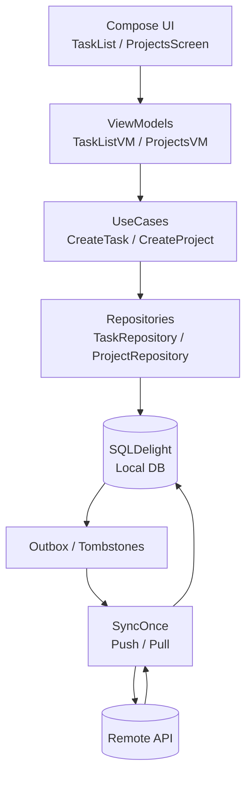
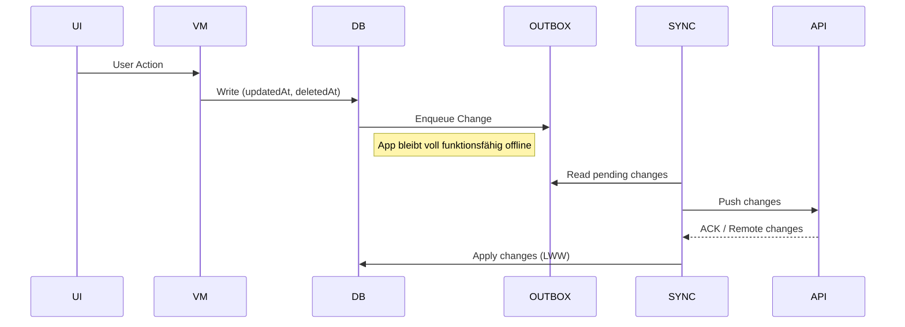

# OPS – Offline-First Task & Project Manager

OPS ist eine Offline-First Android App zur Verwaltung von Tasks und Projekten.
Der Fokus liegt auf robuster Synchronisation, klaren State-Modellen
und einer sauberen Trennung von UI, Domain und Datenebene.

---

## Features

* Offline-First Architektur (voll nutzbar ohne Netzwerk)
* SQLDelight + Tombstones (`deletedAt`) für Sync-sichere Datenhaltung
* Outbox-Pattern (Push) + Cursor-basierter Pull-Sync
* Projekte mit Farbcodierung & Task-Zuordnung
* Jetpack Compose UI mit klaren ViewModel-States
* Emulator ↔ reales Gerät synchronisierbar

---

## Architektur

## Offline-First Synchronisation (Outbox + LWW)

**Offline-First Prinzip**

- Alle Writes gehen zuerst in die lokale DB
- Änderungen werden über eine Outbox persistiert
- Sync ist retry-safe und idempotent
- Konflikte werden per Last-Write-Wins (`updatedAt`) gelöst
- UI blockiert nie auf Netzwerk

**UI**

* Jetpack Compose (Material 3)
* State-Hoisting über ViewModels
* Lifecycle-aware StateFlows

**State & Domain**

* ViewModel + StateFlow
* Klare UseCases (z. B. `CreateProject`, `SyncOnce`)
* Keine Logik in der UI

**Persistence**

* SQLDelight (SQLite)
* UUID-basierte IDs
* `updatedAt` / `deletedAt` für konfliktfreie Synchronisation

**Sync**

* Push: Outbox-Tabelle (retry-safe)
* Pull: Cursor-basierte API
* Konfliktstrategie: Last-Write-Wins

---

## Tech Stack

* Kotlin
* Jetpack Compose
* SQLDelight
* Ktor (Client & Server)
* Coroutines / Flow

---

## Status

Aktiv in Entwicklung.
Der aktuelle Fokus liegt auf Stabilität, transparenter Synchronisation
und einer sauberen Projekt-Verwaltung.
